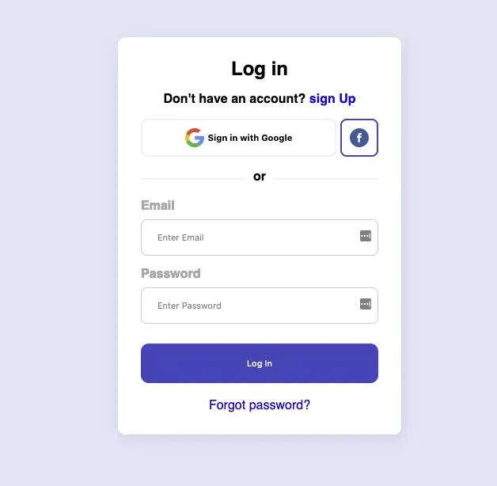

# proyecto-css
Por Bruna Sonda e Iris Sánchez
# ¿Dónde está mi CSS?

**Oh NO! hemos borrado sin querer el código CSS de nuestra página de login.** 


Por suerte, hemos recuperado el `<body>` de nuestra página de log in: 

```html
<div class="card">
   <form>
      <h2 class="title"> Log in</h2>
      <p class="subtitle">Don't have an account? <a href="#"> sign Up</a></p>

      <div class="social-login">
         <button class="google-btn">
            
            <p class="btn-text">Sign in with Google</p>
         </button>
         <button class="fb-btn">
         
         </button>        
      </div>

      <p class="or"><span>or</span></p>

      <div class="email-login">
         <label for="email"><b>Email</b></label>
         <input type="text" placeholder="Enter Email" name="uname" required>
         <label for="psw"><b>Password</b></label>
         <input type="password" placeholder="Enter Password" name="psw" required>
      </div>
      <button class="cta-btn">Log In</button>
      <a class="forget-pass" href="#">Forgot password?</a>
   </form>
</div>
```

<aside>
💡 Compara el código que realizaste en el proyecto ¿Dónde está mi HTML? con el propuesto arriba, ¿Hay diferencias?

</aside>

### Explicación del Proyecto

**¿Qué vamos a hacer?**

Siguiendo con el mismo grupo del proyecto ¿Donde está mi HTML?, vamos a diseñar y aplicar estilos CSS al formulario de Log In existente que sigue una estructura HTML proporcionada.

**¿Dónde lo vamos a hacer?**

Trabajaremos en un archivo CSS que se guardará dentro de una carpeta específica.

**¿Cómo lo hacemos?**

Usaremos etiquetas de CSS3 para dar estilo al formulario, incluyendo posicionamiento, colores, fuentes y espaciado, asegurando que el diseño sea responsivo y visualmente atractivo.

**¿Con qué lo hacemos?**

Utilizaremos CSS3 y un editor de texto como Visual Studio Code. No se permite modificar el HTML, solo se añadirá CSS.

**¿Cómo se evalúa lo que hacemos?**

El proyecto será evaluado en función de la correcta aplicación de los estilos, la organización del código CSS y la capacidad para mantener el diseño alineado con la estructura HTML dada.

---

### Objetivo del Proyecto

El objetivo de este proyecto es **aplicar estilos CSS a la estructura existente de HTML** de un formulario de Log In, siguiendo las buenas prácticas de diseño responsivo y organizado, sin modificar el HTML. Aprenderemos cómo estilizar elementos utilizando propiedades de CSS para mejorar la apariencia y la usabilidad del formulario

---

### Paso a Paso

**Paso 1: Crear la Carpeta del Proyecto**

- Crea una carpeta llamada `donde-esta-mi-css` en tu ordenador donde vas a guardar todos los archivos del proyecto.

**Paso 2: Crear el Archivo HTML**

- Dentro de la carpeta `donde-esta-mi-css`, crea un archivo llamado `index.html`.

**Paso 3: Añade el código HTML abajo al archivo creado en el paso 2**

```html
<div class="card">
   <form>
      <h2 class="title"> Log in</h2>
      <p class="subtitle">Don't have an account? <a href="#"> sign Up</a></p>

      <div class="social-login">
         <button class="google-btn">
            
            <p class="btn-text">Sign in with Google</p>
         </button>
         <button class="fb-btn">
         
         </button>        
      </div>

      <p class="or"><span>or</span></p>

      <div class="email-login">
         <label for="email"><b>Email</b></label>
         <input type="text" placeholder="Enter Email" name="uname" required>
         <label for="psw"><b>Password</b></label>
         <input type="password" placeholder="Enter Password" name="psw" required>
      </div>
      <button class="cta-btn">Log In</button>
      <a class="forget-pass" href="#">Forgot password?</a>
   </form>
</div>
```

**Paso 4: Crear el Archivo CSS**

- Dentro de la carpeta `donde-esta-mi-css`, crea un archivo llamado `styles.css`.

**Paso 4: Añadir Estilos al Formulario**

1. **Inicia el archivo CSS** con un reseteo básico para asegurar que todos los navegadores rendericen de manera consistente.
    
    ```css
    
    * {
        margin: 0;
        padding: 0;
        box-sizing: border-box;
    }
    
    body {
        font-family: Arial, sans-serif;
        background-color: #f5f5f5;
        display: flex;
        justify-content: center;
        align-items: center;
        height: 100vh;
    }
    
    ```
    
2. **Estilizar el contenedor principal** (`.card`) para centrar el formulario y aplicar estilos básicos.
3. **Estilizar el formulario** (`form`) y sus elementos (`h2`, `.subtitle`, `.social-login`, `.email-login`, `.cta-btn`, etc.).
4. **Cerrar y enlazar el CSS en el HTML**:
    - Asegúrate de guardar el archivo CSS y enlazarlo en el HTML.
    
    ```html
    
    <head>
        <meta charset="UTF-8">
        <meta name="viewport" content="width=device-width, initial-scale=1.0">
        <title>Log In</title>
        <link rel="stylesheet" href="styles.css">
    </head>
    
    ```
    

**Paso 6: Guardar y Revisar**

- Guarda todos los cambios en el archivo `styles.css` y revisa que los estilos se apliquen correctamente al HTML proporcionado.

---

### Recursos y Herramientas

- **Editor de Texto**: [Visual Studio Code](https://code.visualstudio.com/)
- **Documentación CSS**:
    - [MDN Web Docs - CSS](https://developer.mozilla.org/en-US/docs/Learn/HTML/Introduction_to_HTML/Getting_started)
    - [CSS Tricks](https://developer.mozilla.org/es/docs/Web/HTML)
    - [W3Schools - CSS](https://lenguajehtml.com/html/introduccion/tabla-periodica-html5/)

---

### Entrega

- **Formato de entrega**:
    - Entragar hasta el 11/04 el enlace de ropositorio de github. Dos enlaces separados, un enlace para el proyecto ¿Dónde está mi HTML? y otro enlace para el proyecto ¿Dónde está mi CSS?.

---

En este proyecto serás capaz de verificar si estás entendiendo cómo funcionan las “cajas” de HTML5 de una página web y podrás practicar dar estilos a una esta estructura HTML5 alineándolos y posicionándolos.

⛔️ Prohibido modificar el HTML entregado aquí. Sólo podemos añadir CSS

### Recursos

[Getting started with CSS](https://developer.mozilla.org/es/docs/Learn/CSS)

[Propiedades de CSS](https://www.w3schools.com/cssref/playdemo.php?filename=playcss_padding)

[CSS Masterclass - Tutorial & Course for Beginners](https://www.youtube.com/watch?v=FqmB-Zj2-PA)

[CSS Crash Course For Absolute Beginners](https://www.youtube.com/watch?v=yfoY53QXEnI)